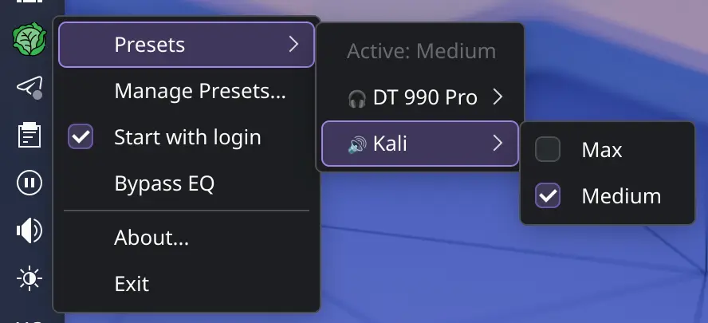
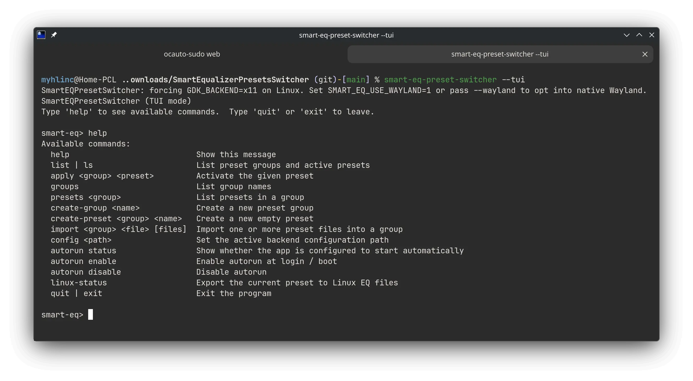

# SmartEQPresetSwitcher

SmartEQPresetSwitcher is a cross-platform EQ preset switcher for managing, editing, applying, importing, exporting and backing up EQ presets. It is built with SvelteKit, TypeScript, Rust and Tauri 2.
Windows uses Equalizer APO as the real system backend. Linux uses a PipeWire-oriented compatibility path: presets are exported to app-managed EQ files and the app can generate a PipeWire filter-chain setup for system-wide routing.

---

## Screenshots

### Main window


Preset library with groups, active preset, editor and EQ backend status.

---

### Tray menu



Quick preset switching and bypass controls from the system tray.

---

### Terminal UI



Full TUI mode for headless and boot-sync workflows.

---

## Release state

Current source version: `0.3.0`.

The repository is intended to be pushed as source only. Generated dependency/build folders are intentionally excluded:

```text
node_modules/
.svelte-kit/
build/
dist/
src-tauri/target/
src-tauri/gen/
```

## What it does

- Organizes EQ presets into groups with drag-and-drop ordering.
- Applies presets from the GUI, tray or TUI.
- Edits preset `.txt` files in-app.
- Imports Equalizer APO preset files and convolution `.wav` files.
- Keeps convolution references synced and can reveal linked files in the native file manager.
- Imports and exports full app-data backups as JSON.
- Imports AutoEQ presets with target-aware variants.
- Stores local timestamped logs and can open the logs folder from the app.
- Supports launch-on-startup on Windows and Linux.
- Supports Linux TUI/headless/boot-sync workflows.
- Exports active presets to Linux EQ files for PipeWire-oriented workflows.
- Provides a Linux “Disable EQ” / bypass mode using a flat shadow preset instead of tearing down PipeWire routing.

## Platform scope

### Windows x64

- Main GUI and tray mode.
- Equalizer APO install/reinstall helper.
- Equalizer APO Device Selector launcher.
- Per-user autorun through the Windows Run registry key.
- NSIS installer build.

### Linux x64

- Main GUI and tray mode when a desktop session is available.
- TUI mode through `--tui`.
- Headless boot-sync mode through `--boot-sync`.
- Desktop autostart through `~/.config/autostart`.
- User systemd boot-sync service through `~/.config/systemd/user`.
- Linux EQ export files under `~/.config/SmartEQPresetSwitcher/linux-eq`.
- Native Arch package, Debian package and optional AppImage build scripts.
- PipeWire filter-chain setup for system-wide EQ experiments.

Equalizer APO itself is Windows-only. Linux support is compatibility/export tooling for compatible EQ preset syntax, not a native Equalizer APO port.

## Current Linux EQ model

SmartEQPresetSwitcher does **not** currently try to “hard disable” Linux EQ by destroying PipeWire links or moving every stream back and forth. That approach was fragile on PipeWire/WirePlumber systems and could mute system audio.

Current Linux behavior is intentionally simpler:

- **Enable/apply preset**: export the active preset, generate/update the parametric EQ file, generate/update PipeWire filter-chain config, and route/reload as supported by the current backend logic.
- **Disable EQ / bypass**: set `eq_disabled=true`, clear active selection, write a flat shadow preset:

```text
Preamp: -0.1 dB
```

The flat shadow preset keeps the EQ pipeline alive but makes it effectively neutral. This is intentionally safer than deleting PipeWire links, deleting the config, or trying to fully tear down the EQ graph.

The active Linux export files are:

```text
~/.config/SmartEQPresetSwitcher/linux-eq/active-equalizerapo.txt
~/.config/SmartEQPresetSwitcher/linux-eq/active-parametric-eq.txt
```

The generated PipeWire snippet is:

```text
~/.config/pipewire/pipewire.conf.d/99-smart-eq-preset-switcher-parametric-eq.conf
```

The PipeWire setup uses `libpipewire-module-filter-chain` and the builtin `param_eq` filter. PipeWire supports user config snippets under the user config directory, and WirePlumber’s `wpctl` is the preferred tool for default-device control on PipeWire/WirePlumber systems. See the references at the end of this README.

## AutoEQ target variants

AutoEQ import supports target-aware variants instead of assuming GraphicEQ only:

- **Auto target**: prefers ParametricEQ / `Filter:` output for Linux PipeWire/EasyEffects and Windows Equalizer APO/Peace, then falls back to GraphicEQ.
- **ParametricEQ / Filter**: preferred for PipeWire filter-chain `param_eq`, EasyEffects-style PEQ workflows, Equalizer APO and Peace.
- **GraphicEQ**: fallback for simple graphic equalizers and manual editing.

If an AutoEQ entry has no parametric variant, the app can still import GraphicEQ and convert it into a conservative parametric approximation for Linux export.

## EQ backend status

The main window has an **EQ backend** status button. It tells the user whether the app is only managing presets locally or whether the OS audio backend is ready to consume the active preset.

Windows status reports:

- Equalizer APO detection.
- Whether APO `ConfigPath` points at the app-managed config folder.
- Whether setup/repair is needed.

Linux status reports:

- PipeWire / pipewire-pulse / WirePlumber / EasyEffects detection.
- Active export path.
- PipeWire filter-chain config path.
- Whether EQ is bypassed through the flat shadow preset.

Important status language:

- **Preset active in app** means only the app selection changed.
- **Preset exported** means files were generated.
- **EQ bypassed** means the app wrote the flat `Preamp: -0.1 dB` shadow preset.
- **System EQ setup** means the PipeWire filter-chain config exists and the current backend attempted routing/reload.

## Runtime layout

### Windows

```text
%APPDATA%\SmartEQPresetSwitcher
%APPDATA%\SmartEQPresetSwitcher\presets
%APPDATA%\SmartEQPresetSwitcher\config
```

If Equalizer APO is still pointing at a protected config directory, the app can move its `ConfigPath` to the writable app-managed folder. Changing `ConfigPath` or updating protected APO files can trigger a Windows UAC prompt.

### Linux

```text
~/.config/SmartEQPresetSwitcher
~/.config/SmartEQPresetSwitcher/presets
~/.config/SmartEQPresetSwitcher/config
~/.config/SmartEQPresetSwitcher/linux-eq
~/.config/pipewire/pipewire.conf.d/99-smart-eq-preset-switcher-parametric-eq.conf
```

## TUI quick start

Interactive TUI:

```bash
smart_eq_preset_switcher --tui
```

Single command mode:

```bash
smart_eq_preset_switcher --tui list
smart_eq_preset_switcher --tui apply MyGroup MyPreset
smart_eq_preset_switcher --tui disable
smart_eq_preset_switcher --tui autorun status
```

Boot sync:

```bash
smart_eq_preset_switcher --boot-sync
```

Autorun CLI:

```bash
smart_eq_preset_switcher --autorun status
smart_eq_preset_switcher --autorun enable
smart_eq_preset_switcher --autorun disable
```

## Build and bootstrap

Detailed build instructions are in [docs/BUILDING.md](docs/BUILDING.md). Linux runtime diagnostics are in [docs/TUI_AND_LINUX.md](docs/TUI_AND_LINUX.md).

### Linux bootstrap and builds

```bash
scripts/bootstrap-linux.sh
scripts/build-linux.sh          # auto: Arch -> pacman package, Debian -> deb
scripts/build-linux.sh --arch   # native Arch package
scripts/build-linux.sh --deb    # Debian package
scripts/build-linux.sh --appimage
scripts/build-linux.sh --all
scripts/build-arch-package.sh
```

On Arch, use the default `scripts/build-linux.sh` or force `--arch`. The output is a native pacman package:

```bash
sudo pacman -U dist/arch/smart-eq-preset-switcher-*.pkg.tar.zst
```

`.deb` is for Debian/Ubuntu users, not for installing on Arch. The Arch package is generated through `tauri build --no-bundle` plus `makepkg`, so the binary embeds production frontend assets while skipping Tauri’s bundlers.

AppImage remains optional. It uses Tauri/linuxdeploy and can fail on some distro/runtime combinations; on Arch the native `.pkg.tar.zst` path is preferred.

On Arch, `rust` and `rustup` conflict. The bootstrap script keeps an existing Rust toolchain by default. Use `scripts/bootstrap-linux.sh --rust` if you use the repository `rust` package, or `scripts/bootstrap-linux.sh --rustup` if you want rustup.

### Windows bootstrap and build

```bat
scripts\bootstrap-windows.bat
scripts\build-windows.bat
```

Expected Windows output is the Tauri Windows bundle under `src-tauri\target\release\bundle`.

## Runtime diagnostics

App log:

```bash
cat ~/.config/SmartEQPresetSwitcher/logs/application.log
```

Run foreground:

```bash
smart-eq-preset-switcher --gui 2>&1 | tee /tmp/smarteq-run.log
```

Linux audio checks:

```bash
pactl get-default-sink
pactl list short sinks
pactl list short sink-inputs
wpctl status --name
pw-link -lI | grep -i 'smart\|eq\|alsa_output'
journalctl --user -u pipewire.service -u wireplumber.service -b -n 120 --no-pager
```

Systemd/journal/coredump checks:

```bash
journalctl --user -b --grep='SmartEQPresetSwitcher|smart-eq-preset-switcher|smart_eq_preset_switcher' --no-pager
journalctl -b _COMM=smart-eq-preset-switcher --no-pager
coredumpctl list smart-eq-preset-switcher smart_eq_preset_switcher
coredumpctl info smart-eq-preset-switcher
```

A normal Tauri/WebKitGTK desktop run may show multiple processes: the main app, a WebKit web process and a WebKit network process. That is not by itself a memory leak; a leak means RSS keeps growing while idle.

## KDE/Wayland runtime notes

The packaged Linux launcher defaults to conservative X11/XWayland GTK/WebKit settings for GUI reliability on KDE/Wayland/NVIDIA systems.

Explicit native Wayland test:

```bash
SMART_EQ_USE_WAYLAND=1 smart-eq-preset-switcher --gui
smart-eq-preset-switcher --wayland --gui
```

Explicit tray/background mode:

```bash
smart-eq-preset-switcher --tray
```

Disable the GUI tray for troubleshooting:

```bash
SMART_EQ_DISABLE_TRAY=1 smart-eq-preset-switcher --gui
```

## Equalizer APO setup

Use the `Troubleshoot` button in the main window on Windows to:

- Download and silently install Equalizer APO with the official `/S` installer.
- Re-run the same install chain if the install needs repair.
- Open the official Device Selector so playback and capture devices receive APO processing.

On Linux these Windows-only actions are hidden from the main UI and return clear unsupported-platform errors if called directly.

## Rename and data migration

The project was previously named `SmartEqualizerAPOPresetsManager`. Runtime folders, executable names, package names, desktop files and docs now use `SmartEQPresetSwitcher`.

On first start, the app migrates the old per-user data folder when possible:

```text
SmartEqualizerAPO -> SmartEQPresetSwitcher
```

Existing managed config markers from the old app name are still recognized and replaced with new `SmartEQPresetSwitcher` markers when the active config is rebuilt.

## Development checks

```bash
npm ci
npm run check
bash -n scripts/*.sh
scripts/check-project.sh --strict-source
```

For a clean source/package tree check:

```bash
scripts/check-project.sh --strict-source --fail-local-generated --skip-npm --skip-cargo
```

## References

- [Tauri CLI reference](https://v2.tauri.app/reference/cli/)
- [PipeWire filter-chain module](https://docs.pipewire.org/page_module_filter_chain.html)
- [PipeWire user configuration snippets](https://docs.pipewire.org/page_man_pipewire_conf_5.html)
- [WirePlumber wpctl](https://pipewire.pages.freedesktop.org/wireplumber/tools/wpctl.html)
